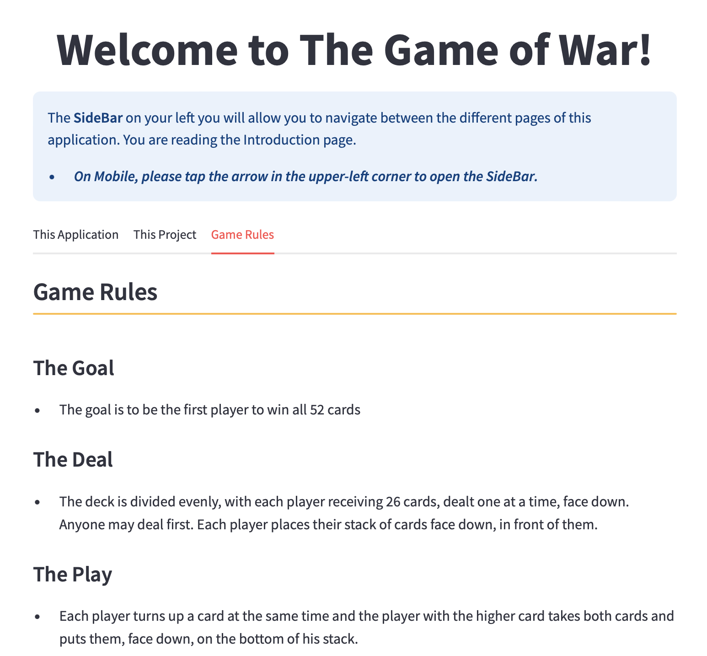

# Play The Game For Yourself: [Here](https://nathansautomatedcardgame.streamlit.app)

Explore the classic card game 'War' reimagined in Python and Visual Basic for Applications (VBA), featuring implementations both as a Streamlit web app and an Excel-based experience!
## Project Repository Located: [Here](https://github.com/najtompkins/automated_card_game)

### Developer: Nathan-Andrew Tompkins
### LinkedIn: [www.linkedin.com/in/nathan-andrew-tompkins](https://www.linkedin.com/in/nathan-andrew-tompkins/)

### Streamlit Intro Page:

    

### Excel Intro Page:

    

## Overview

- Originally designed as a personal challenge in coding and logical-process development, this project evolved into a robust application developed in both Python and VBA, two very different development languages each with their own use in the final products. The goal was to create a simple simulation of the 'War' card game that would generate a winner at the touch of a button. What became of this challenge was a much more versatile and interactive simulation game which runs on different platforms. 
- In the Python version (above, left,) I utilized the PyDealer library ([documentation here](https://pydealer.readthedocs.io/en/latest/)) for efficient card-class management, Streamlit ([documentation here](https://docs.streamlit.io)) for the app's built-out-and-deploy framework, and of course my custom functions for simulating 'War' and generating the data for each round, displayed on the 'Stats Dashboard' page of the app.
- Within the VBA/Excel version (above, right) the existing cell/range/worksheet environment allowed for easier card handling using custom macros. A small animation plays before the game officially begins and message-boxes prompt the user to shuffle, deal, then simulate the game proper.
    - *Note that macros must be enabled ***prior to opening the file for the first time*** for the excel version of this program to run properly*
    - *Note as well that this version was developed for Windows and encounters an error when run on MacOS which renders it unusable. This is unsurprising as Microsoft's support for extensive VBA/Macro usage on MacOS is not exhaustive.*

### *Please enjoy learning about all of the unique aspects of this project and feel free to play the game yourself by following the links below.*

# The Game
## Project Versions
### Streamlit Web App: - [Play War!](https://nathansautomatedcardgame.streamlit.app)

1. **Summary**: Experience the final version of this project in a modern web application format, accessible from any device! This version is a testament to the flexibility and power of converting a traditional Python application (as seen in version 3 below) into an engaging web experience.
2. **Landing Page**: Starting at the Landing Page, you are introduced to the application, the development history, and the rules of the 'War' card game, all within easy-to-navigate tabs under the greeting to the user.
        

        
        
        
        

3. **War Room**: Once the user has read all they want about the application and its development they are directed to the 'War Room', the page where all of the magic happens! This page prompts the user to play the game. (If they do not play the game, the other pages will not show any content other than the option to go back to this page.) After the user chooses to play the game, the page will be populated with a greeting, buttons to iterate through the rounds in increments of 1, 10, or 50 rounds, and charts below to view the game's progress in real-time! A 'Finish the Game' button is also available to those who want to simulate the game until its completion.
        

        
        
        
        

    1. As the game simulates and the data is generated round after round, the charts below are updated. Card Ownership is rendered both as a pie chart (above) and a line graph (below.) Each have visual advantages, namely the line-graph displaying the symetrical distibution of card ownership as the players trade-off their wins and losses. Annotations are added to highlight the highest amount of cards each player aquired and at which round.
        

        
        

4. **Stats Dashboard**: The game has been won! The winner has been declared and that winner's color (Player 1: Blue, Player 2: Orange) is the primary color highlighted in the 'Stats Dashboard** page. Here you can see the Game Data displayed (left) as well as Player 1's data (center), and Player 2's Data (right)
        

        
        
        
        

    1. The below line charts are rendered at the bottom of each player's dashboard. These charts are much more extensive in the data that they display and allow the user to better visualize how each player was doing throughout the rounds, how many times the players traded dominance (holding the most cards) or how many Wars there were in total.
        

        
        

        

        
        

5. **Generated Dataframe**: This life-blood of the game is the logic, but the ***substance*** of the project is the game data! In this page you can see each dataframe that the statistics in the above dashboards draw from. The Game Data includes metrics for the game as a whole while each player has their own metrics recorded in their own dataframes. Each of these are available by selecting the appropriate tab.
        

        
        
        
        

6. **The Code**: All of this operates on a few thousand lines of code. Below are a few snippets of that code so that you can get an understanding of how this was structured in the background. The code in full is available to peruse over in the [streamlit_application directory](./streamlit_application).
        

        
        
        
        

        

        
        
        
        

### **Excel VBA Workbook**: - [Download Excel Workbook](./excel_files/WarCardGame.xlsm)
1. **Summary**: Dive into the Excel adaptation of 'War' where game logic and visual feedback are merged. This version highlights the adaptability of VBA in creating interactive, data-rich user experiences, animations, and dashboards. This version is robust but imperfect. Designed as a proof-of-concept it is a working prototype which takes the user from and introduction to the game's rules all of the way through to a custom dashboard of game and player metrics.
    - *Note: Due to Microsoft's robust security settings around the usage of macros in workbooks downloaded from the internet (such as the one linked above,) after you have downloaded it, the file must be 'trusted' ***prior to opening the workbook for the first time***. Once open, you must select the 'Enable Macros' button at the top of the screen for the Excel version of this program to run properly.* (*For more information about trusting a file, check out Microsoft's own page about it [here](https://support.microsoft.com/en-us/topic/a-potentially-dangerous-macro-has-been-blocked-0952faa0-37e7-4316-b61d-5b5ed6024216).*)
    - *Note (again): This workbook version was developed for Windows using Microsoft Excel 365. When run on MacOS (tested on: Sonoma 14.0) the macros encounter an error which render it unusable. This is unsurprising as Microsoft's support for extensive VBA/Macro usage on MacOS is not exhaustive. Re-testing on the Windows OS does not replicate this error.*

3. **The Introduction**: Once the workbook has been trusted you will be greeted with an animation (in Excel?? Yes! But I can't link to it here in the ReadMe) that renders the words "LET'S GO TO... WAR!" one after the other. The user is then brought to the Game Rules worksheet. This worksheet explains the rules of the game and also contains a button that, once pressed, initialized the game environment set-up. Original War rules are cited from [here](https://bicyclecards.com/how-to-play/war) beneath the cells.
        

        
        

3. **Shuffling and Dealing**: The 'Front-End' is generated, but the players need their cards, so the user is prompted to shuffle the deck of cards, then prompted again to deal those cards. Both of these processes are handled by macros that run once the user presses 'Ok' on the message boxes.
        

        
        
        

4. **The Front End**: The 'Front End' worksheet, previously generated once the player clicked 'Play the Game!' now changes into it's proper form: Two players, one on either side, a comparison table in the center, and discard piles off to the sides. Another 'Play War!' button is presented that, once pressed, simulates the entire game. Unlike the Streamlit App version above you cannot increment through the rounds and must wait for the game to be simulated. A winner must be declared before the user can interact with Excel again, as this is a limitation to running macros so extensively.
        

        
        

        

        
        

5. **Game Stats Dashboard**: We made it to the 'Stats Dashboard' worksheet! The game has been fully simulated, a winner has been declared, and all that is left is to view the data. Much like the Streamlit version of this program this workbook generates nearly 40 different metrics throughout the simulation. Each of these metrics can be viewed in full in the next section below this one. This Dashboard summarizes many of those datapoints for the user to see how the game progressed.
        

        
        

        

        
        

        

        
        

        

        
        

6. **Generated Game Data**: After all has been done, the user is free to explore the other worksheets. A few buttons exist between the 4 worksheets that allow the user the simulate another game. The 'Game Data' worksheet presents the use with every metric recorded during the game. Longer games result in longer tables, shorter games, the opposite. Each row is either a complete round, or a sub-round within a War.
        

        
        

7. **Hidden Macros**: As mentioned, this version operates using macros. Another word for macros in this context are subroutines. Everything from comparing card values to each other using Index/Match functions, to shuffling the starting deck, creating the front end, or dealing cards back into the players' hands when they've run out... they are all subroutines developed for this workbook. Take a look at a few below. 
    - **Note: The shuffling algorithm sub was generated using ChatGPT 4 on 3/16/24. This entire codeblock was generated so that development effort could be spent on the rest of the program. GPT was also utilized in other areas throughout the program, though mostly for aesthetic and UX purposes.**
        

        
        
        
        

        

        
        
        

### **Python Implementation**: - [View Notebook](./ipynb_files/war_v6_data.ipynb)
1. **Summary**: Peek into (or use!) the Jupyter Notebook version of 'War'. This version uses custom functions for dealing cards, handling comparisons, Wars, data generation/reporting and declaring a winner after any number of game rounds. This is the original working code-base for this game upon which the Streamlit version is built. It allows the user to run each portion of the code and before running the next. The power of this version comes from first running the (`set_up_game_environment()`) function cell followed by the (`play_war()`) function cell. The latter will output round information via print-statements. Round and game information generated here is available in the dataframes in in the final cells of the code.
        

        
        

        

        
        

2. **Other Functions**: Below are a few more glimpses into the code behind this simulator.
        

        
        
        
        

        

        
        
        

        

        
        
        

# Project Upload Timeline
### Development Journey
*Please note again that while the three versions of this application are available to you (via the above links) these are minimally viable products, meaning that they are functional but not perfect. Only the Streamlit version is assumed to be further developed. Thank you for playing my game!*

## Streamlit Web Application
### Cloud-Based Innovation
- **April 10, 2024**: Released the Streamlit web version, enhancing accessibility and interactive capabilities. [Play Now](https://nathansautomatedcardgame.streamlit.app)

### Refined Page Loading
- **April 14, 2024**: Fixed bugs when navigating through the Streamlit application's pages and included navigation buttons at the top of the Introduction page for easy navigation on mobile interfaces.

### Refined User Navigation
- **April 15, 2024**: Utilized dedicated Streamlit elements to enhance user navigation throughout the pages, as well as begun constructing the statistics dashboards in the "Stats Dashboard" page. Enhanced the charts in the "War Room" page by adding annotations and other elements.

- Fixed bugs when users would zoom in on the bar chart element of the "War Room" page, leaving data to be unreadable.

### Stats Dashboard Build-Out
- **April 18, 2024**: Pre-Finalized build-out of 'Stats Dashboard' page, complete with elements for game and player metrics, charts, etc (metrics colored using winner's primary player color). Added buttons on various pages to better enhance user-navigation through the app.

- Fixed various bugs.
### Refined Various Elements
- **April 19, 2024**: Finalized build-out of 'Stats Dashboard' pages, refning metric 'delta' elements for better readability. 
Added config.toml file to project directory for a consistent light-themed experience as many chart elements do not look great in dark theme. 
Chart elements were also adjusted to avoid overlapping annotations and over-extended X range on the right side of the chart. 
Restructured st.metric elements into 4 columns on the Game Data tab.

- Fixed various bugs.

### Enhanced Introduction Page
- **April 21, 2024**: Enhanced the Introduction page to bring it closer inline to this README, linking to it and so that the project's cohesion between documentation and application are closer in step, adding tabular sections for easier navigation, and some of the images also linked above.

-**April 22, 2024**: Fixed errant hyperlinks on the Introduction page of the application, added buttons for navigation between pages. Some previous hyperlinks opened a new session of the app which confuses the player if they've simulated a War and no longer see the data becuase of these new sessions.

### Future Features
 - **Dataframe Conditional Formatting**: In all dataframe elements present in the application each row will be subtly colored to the corresponding winner of that round, and if the case where there is a War and there is not round winner, a redish color will appear.
 - **Custom Name and Colors for Players**: In the Landing Page I want to add text-box inputs that will allow the user to choose their name (defaulted to Player 1 or 2 at this moment, hard-coded) and colors to represent them as either player during the simulation game and subsequent metrics.

## Excel Workbook
#### Diversification into Excel
- **April 5, 2024**: Unveiled the Excel version, leveraging VBA for dynamic gameplay and visual statistics. [Explore Excel Version](./excel_files/WarCardGame.xlsm)

## Jupyter Notebook War Simulator.
### Initial Exploration
- **March 1, 2024**: First iteration deployed. The program runs indefinitely, highlighting the need for refined comparison and win conditions. [View Version 1](./ipynb_files/war_v1.ipynb)
### Refinements and Debugging
- **March 5, 2024**: Introduced a more structured game flow. [View Version 2](./ipynb_files/war_v2.ipynb)
- **March 12, 2024**: Addressed issues in game logic, still perfecting the win conditions. [View Version 3](./ipynb_files/war_v3.ipynb)
- **March 15, 2024**: Achieved a fully functional game with robust handling of game states and card permenance. [View Version 4](./ipynb_files/war_v4.ipynb)

### Advanced Enhancements
- **April 2, 2024**: Launched a highly optimized version, integrating sophisticated data structures for the generation of game and round data into Pandas Dataframes for further analytics. [View Version 6](./ipynb_files/war_v6_data.ipynb)

## Lessons Learned
Each version of the project brought new insights into application design, user interaction, logical processes, and the robustness of game mechanics across platforms. This journey from a simple console application to an interactive web experience showcases the evolution of software development through practical implementation.
